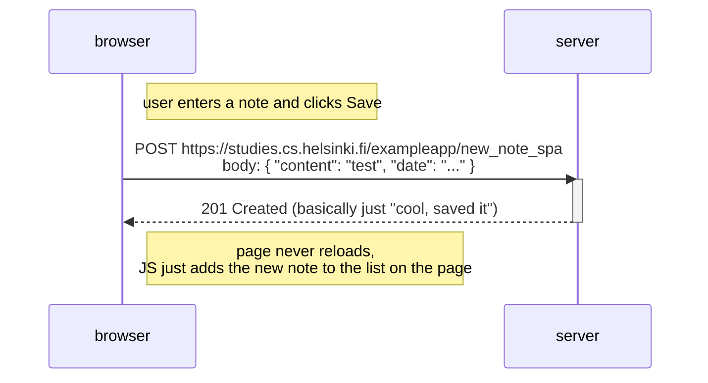

```mermaid
sequenceDiagram
    participant browser
    participant server

    Note right of browser: user enters a note and clicks Save

    browser->>server: POST https://studies.cs.helsinki.fi/exampleapp/new_note_spa<br/>body: { "content": "test", "date": "..." }
    activate server
    server-->>browser: 201 Created (basically just "cool, saved it")
    deactivate server

    Note right of browser: page never reloads,<br/>JS just adds the new note to the list on the page
```